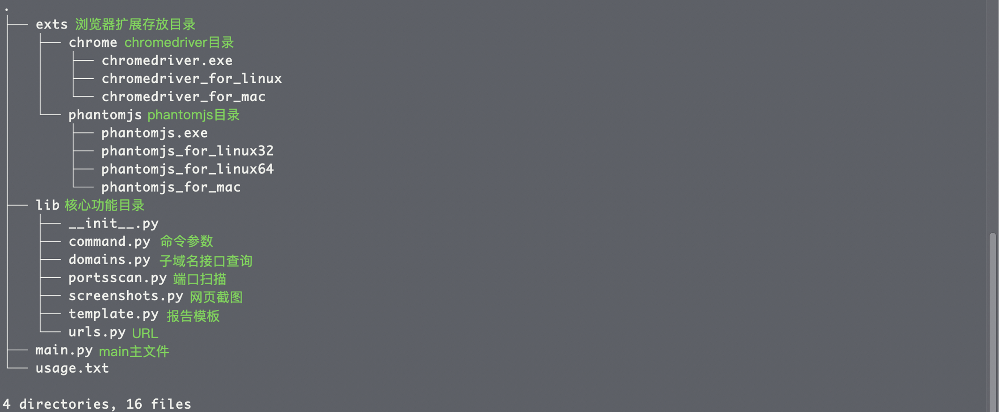
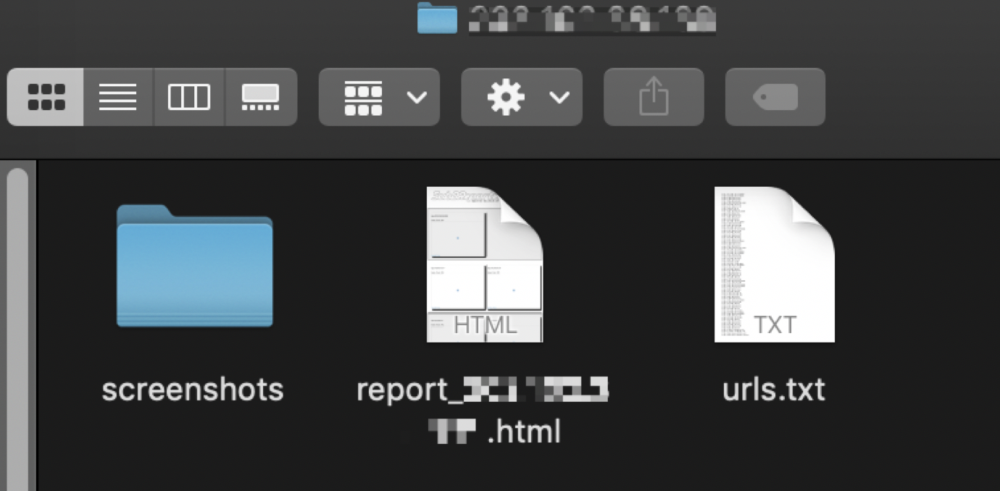
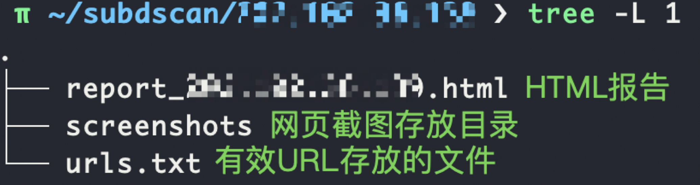
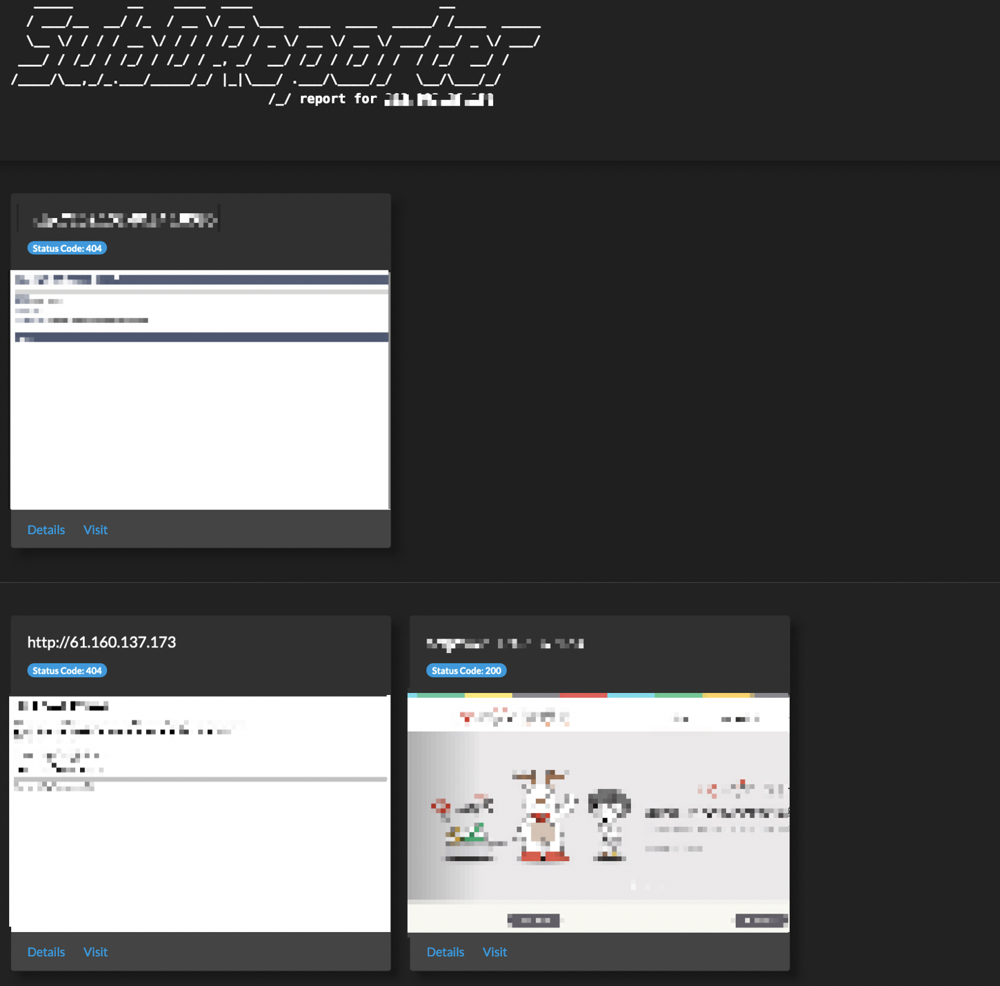
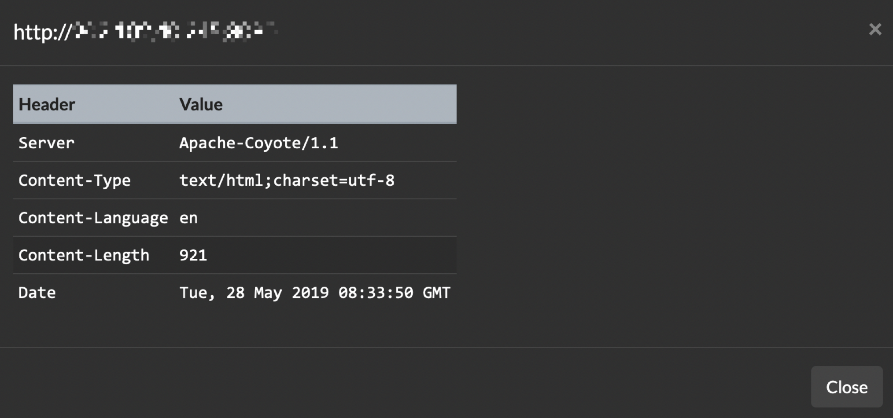

# SubDReporter

## SubDReporter 介绍

> SubDReporter是一款子域名报告生成工具；其功能一共有两个：1.子域名发现 2.子域名报告，子域名发现功能包含了子域名报告功能。

**语言：** Python3
**所需Python3的库：** selenium、requests、beautifulsoup4、lxml
**优点：** ubDReporter支持多线程、跨平台（Linux、Windows、Mac）
**缺点：** 占用大、小几率漏报

### SubDReporter 目录结构：



### 子域名发现功能流程

1.	调用程序所写接口查询功能获取相关子域名并去重生成结果；
2.	对子域名进行IP转换（获取出解析到内网的子域名），最后对解析后的IP进行端口扫描并生成127.0.0.1:80（127.0.0.1开启了80端口）这样的结果；
3.	对端口扫描的结果进行网址（URL）的生成，其生成的格式是（127.0.0.1:80->http://127.0.0.1 、 127.0.0.1:443->https://127.0.0.1 、 127.0.0.1:8080->http://127.0.0.1:8080 && https://127.0.0.1:8080）
4.	对生成的URL进行请求，超出设定的延时时间以及访问出错的URL视其为无效URL即保留有效URL和保存其响应报文；
5.	对有效URL结果进行访问（使用phantomjs或chromedriver）截图；
6.	生成HTML报告。

### 子域名报告功能流程

除了没有子域名发现功能的第一个流程以外其他都与子域名发现功能流程一样。

### 子域名发现接口配置

`/SubDRepoter/lib/domains.py`文件内修改virustotal、findsubdomains、securitytrails函数的key值才可以正常使用（需要自我申请）

## SubDReporter 使用方法

### 举例说明

SubDReporter的参数：
```
-m 模式：该选项有两个（Scanner模式:s Reporter模式:r） e.g. -m s
-i 目标：根据扫描模式选择，如果为Scanner模式则为一个域名；反之则为一个存储了域名的文本文件。
-t 线程
-p 端口：逗号分隔端口（80,8080,443,8081,8088）
-b 浏览器：这个主要用来做截图的（phantomjs:p、chromedriver:c） e.g. -b c
```

**实际使用：**
**需求：** 对目标qianxin.com使用子域名发现功能，线程为10，扫描端口为80,443,8080,8081，使用的截图浏览器为chromedriver
使用： `python3 main.py -m s -i qianxin.com -t 10 -p 80,443,8080,8081 -b c`

**需求：** 对1.txt内的IP、域名【注：非URL！】使用子域名报告功能，线程为10，扫描端口为80,443,8080,8081，使用的截图浏览器为phantomjs
使用：`python3 main.py -m r -i 1.txt -t 10 -p 80,443,8080,8081 -b p`

### SubDReporter 结果

SubDReporter运行结束后会在运行目录下生成subdscan目录，在subdscan目录中会有目标目录，进入目标目录会有三个文件\目录（如果发现有解析到内网IP的域名则会有第四个文件）：





打开HTML报告展示的结果是这样的（参考Aquatone）





URL、响应状态码、网页截图、Details(响应报文)、Visit（打开URL）

## END

感谢项目：https://github.com/michenriksen/aquatone

如有使用问题和意见之类的可发邮件到admin@gh0st.cn或者微信找我，使用愉快～😁


